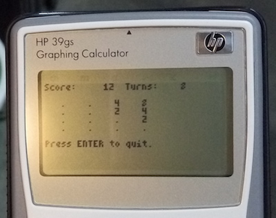

2048 Game for HP 39gs Graphing Calculator
=====



The original program is written by `cuadue`, I fork from . Thanks cuadue!

Sliding tile puzzle game in the terminal. The goal is to build the elusive
`2048` tile by combining two `1024` tiles, which is in turn produced by
combining two `512` tiles, which are built up from randomly dropped `2` and
`4` tiles.

To combine tiles, slide all the pieces up, down, left or right.  Each slide
counts as one turn. When two tiles with the same value slide together, they
combine, leaving an empty space filled by the tiles sliding in the same
row/column and in the same direction. A slide may combine more than one pair
of tiles in each row/column.

Valid moves must either combine at least one tile, or move at least one
tile. After each valid move, either a `2` tile (90% chance) or a `4` tile
(10% chance) will be placed in a randomly chosen empty space. The empty
space may be newly emptied in the previous turn.

The score is simply the summation of the value of all tile combinations.

The game is over when no moves are possible.


Here's a monochrome screenshot:

```
Score:    122  Turns:   40
                          
   .    .    .   16       
   .    .    4   32       
   .    2   16    8       
   4    8    4    2
   
press ENTER to quit
```

